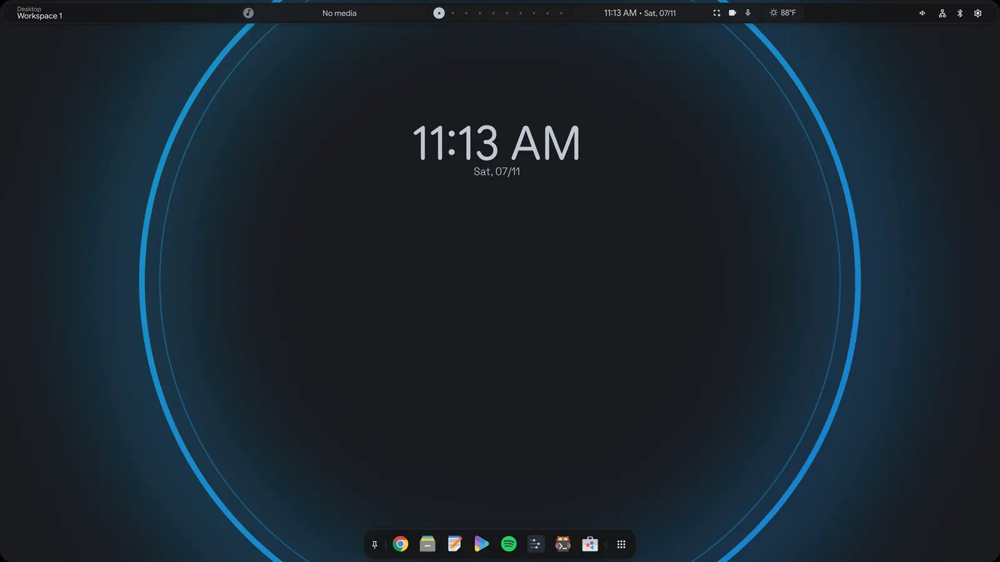
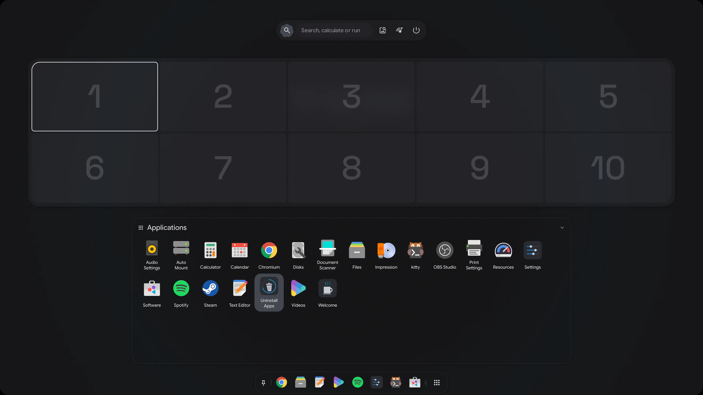
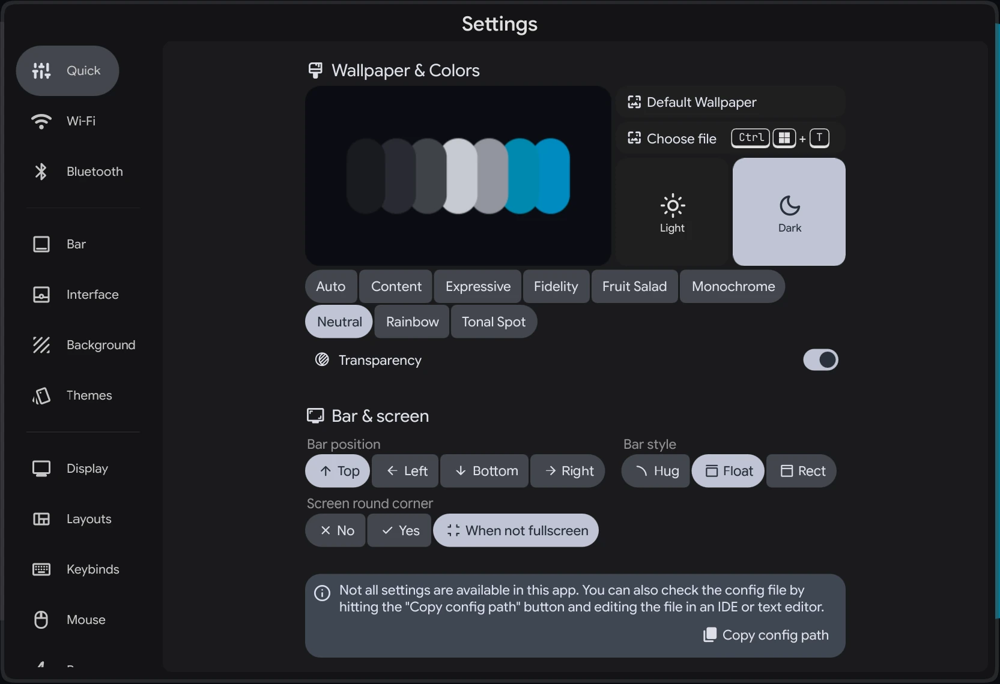
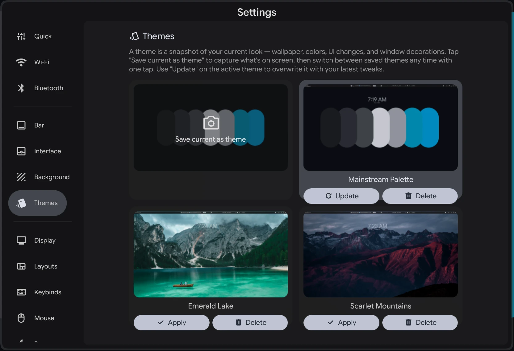
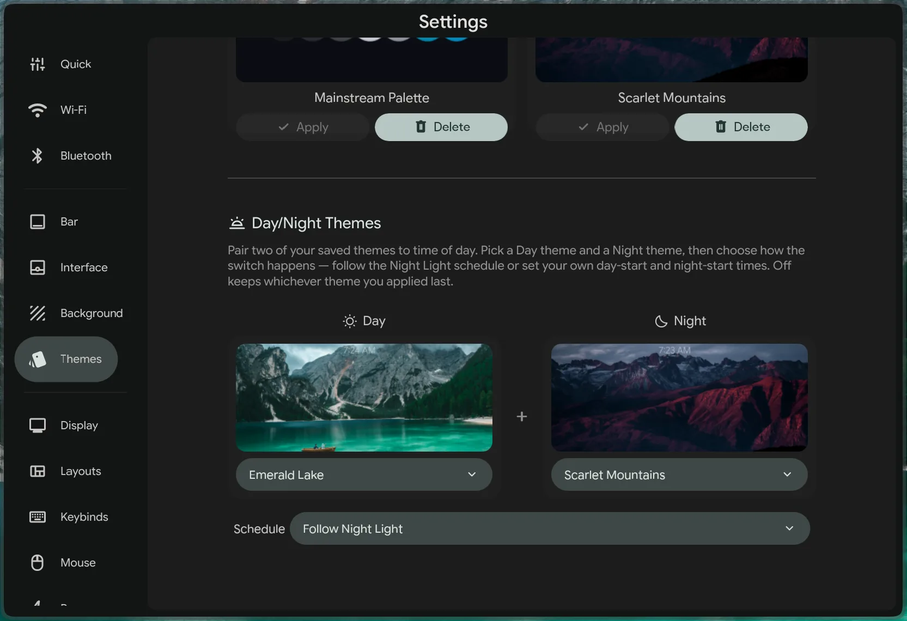
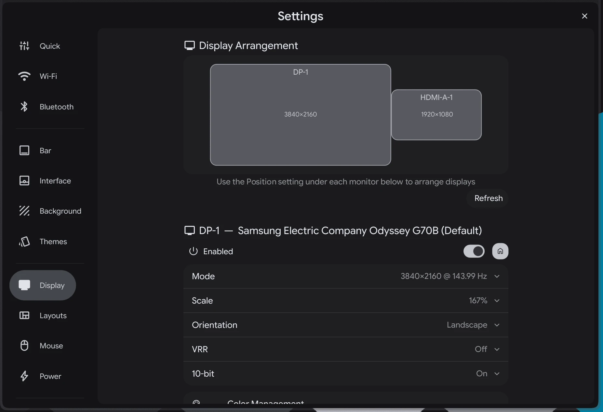
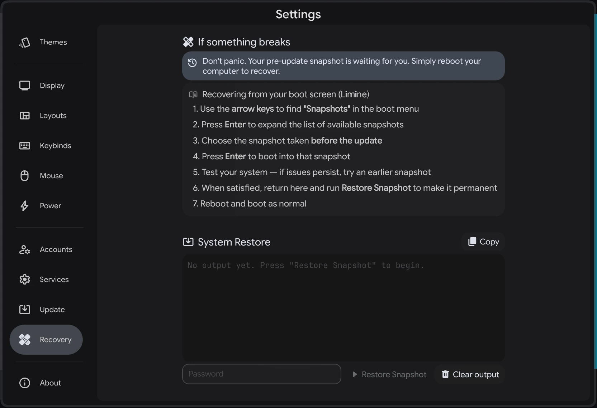
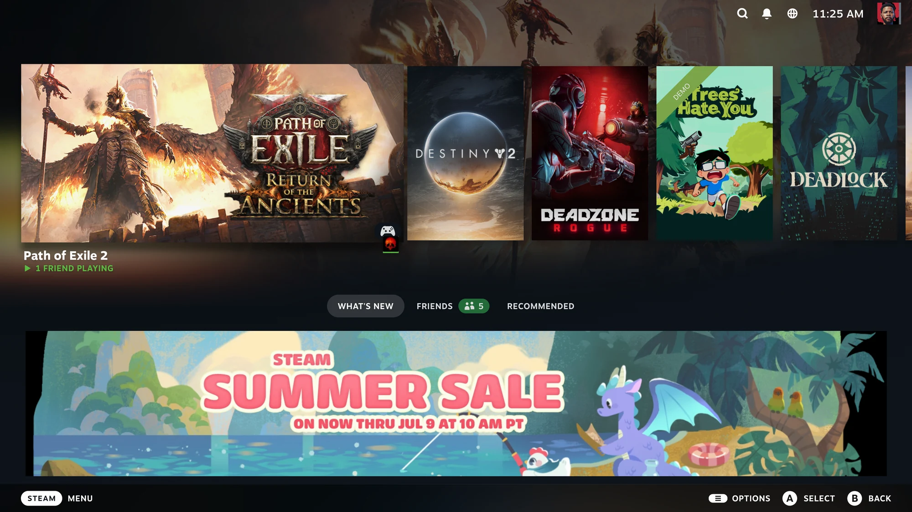

    
    <h3></h3>

    

Arch under the hood, Hyprland on the surface, and the kind of care that makes it feel at home on your mom's laptop and your rendering rig. Deeply featured. Genuinely friendly.

This repository is the desktop itself — the Quickshell shell, the Hyprland configuration, and the `./setup` tooling that turns a fresh Arch install into Mainstream OS. The ISO builder lives at [MainstreamOS/archiso](https://github.com/MainstreamOS/archiso) and the signed package repo at [MainstreamOS/packages](https://github.com/MainstreamOS/packages). Mainstream ships end-4's [illogical-impulse](https://github.com/end-4/dots-hyprland) shell the way Ubuntu ships GNOME — as one credited, continuously-upstream-merged component of a full operating system.

## Install

- **The OS (recommended)** — [Download the ISO](https://github.com/MainstreamOS/archiso/releases/latest) (x86_64 · 2.7 GB), flash it to a USB drive, boot and click through. Dual-boot and full-disk encryption are supported.
- **On an existing Arch install** — run `bash <(curl -fsSL https://mainstreamos.org/install.sh)`. Takes about 10 minutes, and every command is shown before it runs.
- Once you're in: `Super` + `Tab` opens the keybind list, `Super` + `T` opens a terminal.

See the [install guide](https://mainstreamos.org) for details.

## Features

- **Material themes from your wallpaper** — pick a wallpaper and the whole desktop recolors to match; save your favorite looks and schedule Day/Night switching.
- **Session restore** — log out or reboot and your windows come back: same apps, same workspaces.
- **Scrolling overview** — a zoomed-out map of every workspace; drag windows, files, and folders between them.
- **A launcher that finds everything** — apps, folders, files, and quick math.
- **LocalSend built in** — drag a file onto the bar's media widget to send it to any device on your network; right-click to receive. No cloud.
- **Updates with a safety net** — automatic snapshots before every update, and rollbacks right from the boot menu.
- **Gaming Mode** — switch into a SteamOS-style Big Picture session and back with one click, with Proton GE preinstalled so Windows games run out of the box.
- **Made for creators** — guided setup for DaVinci Resolve and OBS, with GPU encoding on Wayland.
- **App management without a terminal** — install native packages and Flatpaks from one place, and remove what you don't want with the Uninstall Apps tool.
- **Auto drive mounting** — set a drive up once and it's ready every login; blank disks get one-click formatting and naming, and encrypted drives unlock right in the app.
- **Title bars, your call** — optional window title bars you can toggle on or off instantly.
- **A lean, native base** — native apps as defaults, and the AUR off by default in favor of the signed [mainstream] repo.

## Screenshots

| Custom Overview/App Launcher | Quick settings |
|:---:|:---:|
|  |  |
| **Custom Themes** | **Day & Night Themes** |
|  |  |
| **Native Display Settings** | **Layout Switching** |
|  |  |
| **One Click Full Update** | **Automatic Recovery** |
|  |  |
| **One Click Full Featured OBS Install** | **One Click DaVinci Resolve Setup** |
|  |  |

    <b>Gaming Mode</b>
      
    

## Under the hood

| Software | Purpose |
| ------------- | ------------- |
| [Hyprland](https://github.com/hyprwm/hyprland) | The compositor (manages and renders windows) |
| [Quickshell](https://quickshell.outfoxxed.me/) | The shell: bar, dock, overview, settings, lock screen |
| [Calamares](https://github.com/MainstreamOS/calamares) | The graphical installer |
| [Limine](https://github.com/limine-bootloader/limine) + [Snapper](https://github.com/openSUSE/snapper) | Boot menu with snapshot rollbacks |
| [mainstream] | Signed repo of prebuilt packages — no AUR builds on your machine |

## Support

- [Documentation](https://mainstreamos.org) — install guides, every settings page, creative setup, and the security model
- [Issues](https://github.com/MainstreamOS/dots-hyprland/issues) for bugs, [Discussions](https://github.com/MainstreamOS/dots-hyprland/discussions) for questions and ideas

## Thank you

- [end-4](https://github.com/end-4), for [illogical-impulse](https://github.com/end-4/dots-hyprland) — the starting point for Mainstream's shell
- [@clsty](https://github.com/clsty) for the original install tooling
- [@midn8hustlr](https://github.com/midn8hustlr) for the color generation system
- [@outfoxxed](https://github.com/outfoxxed/) for [Quickshell](https://quickshell.outfoxxed.me/)
- [@yayuuu](https://github.com/yayuuu) for [Scroll Overview](https://github.com/yayuuu/hyprland-scroll-overview), the plugin behind the scrolling overview
- The [Calamares](https://calamares.io) team for the installer framework
- [@ful1e5](https://github.com/ful1e5) for the [Bibata](https://github.com/ful1e5/Bibata_Cursor) cursor theme
- [@xCaptaiN09](https://github.com/xCaptaiN09) for the [Pixie](https://github.com/xCaptaiN09/pixie-sddm) SDDM theme
- [@BlueManCZ](https://github.com/BlueManCZ) for [hyprmod](https://github.com/BlueManCZ/hyprmod), the base of the Keybinds settings
- [Arch Linux](https://archlinux.org) — the base distribution and archiso

Sponsor links for every project live in Settings → About.

## License

[GPLv3](../LICENSE). Copying: absolutely, feel free — just follow the license and it's all good.
